# Integrazione Catasto OpenAPI per IMU 2025

## Panoramica

Questo sistema implementa l'integrazione completa con le **API del Catasto OpenAPI** dell'Agenzia delle Entrate per la raccolta automatica dei dati catastali necessari al calcolo dell'IMU 2025.

### Caratteristiche Principali

✅ **Raccolta dati automatica** - Estrazione completa di fabbricati e terreni  
✅ **Gestione rate limiting** - Rispetto dei limiti API (40-2000 richieste/giorno)  
✅ **Gestione errori avanzata** - Codici errore specifici e retry logic  
✅ **Mappatura automatica** - Conversione dati catastali → parametri IMU  
✅ **Logging dettagliato** - Tracciamento completo delle operazioni  
✅ **Configurazione flessibile** - Supporto sandbox e produzione  

## Architettura del Sistema

```
📁 services/
  └── catasto-service.ts     # Servizio principale API OpenAPI
📁 types/
  └── catasto.ts            # Interfacce dati catastali
📁 data/
  └── catasto-mapper.ts     # Mappatura catasto → IMU
📁 examples/
  └── catasto-api-example.ts # Esempi di utilizzo
```

### Flusso di Integrazione

```mermaid
graph TD
    A[Codice Fiscale/PIVA] --> B[ricerca_nazionale]
    B --> C[Province con immobili]
    C --> D[ricerca_persona per Fabbricati]
    C --> E[ricerca_persona per Terreni]
    D --> F[Conversione → FabbricatoCatastale]
    E --> G[Conversione → TerrenoCatastale]
    F --> H[Mappatura parametri IMU]
    G --> H
    H --> I[Calcolo IMU automatico]
```



## Configurazione

### 1. Variabili Ambiente

Crea un file `.env` con le credenziali OpenAPI:

```bash
# Configurazione OpenAPI Catasto (Sandbox)
OPENAPI_SANDBOX_URL=https://api.sandbox.openapi.com
OPENAPI_SANDBOX_KEY=your-api-key
OPENAPI_SANDBOX_TOKEN=your-bearer-token

# Configurazione OpenAPI Catasto (Produzione)
OPENAPI_PRODUCTION_URL=https://api.openapi.com
OPENAPI_PRODUCTION_KEY=your-production-key
OPENAPI_PRODUCTION_TOKEN=your-production-token
```

### 2. Ottenere le Credenziali

1. **Registrati** su [console.openapi.com](https://console.openapi.com)
2. **Iscriviti** al servizio "Catasto" 
3. **Genera** API Key e Token dalla dashboard
4. **Ricarica** il wallet per le richieste a pagamento

### 3. Costi e Limiti

| Tipo | Costo | Limite Giornaliero |
|------|-------|-------------------|
| **Base** | €0.30/richiesta | 40 richieste |
| **Subscription Mensile** | da €0.20/richiesta | 100-2000 richieste |
| **Subscription Annuale** | da €0.15/richiesta | 500-2000 richieste |

## Utilizzo

### Esempio Base

```typescript
import { CatastoService, CatastoConfig } from './services/catasto-service';

// Configurazione
const config: CatastoConfig = {
  baseUrl: process.env.OPENAPI_SANDBOX_URL!,
  apiKey: process.env.OPENAPI_SANDBOX_KEY!,
  token: process.env.OPENAPI_SANDBOX_TOKEN!
};

const catastoService = new CatastoService(config);

// Raccolta dati completa
const { fabbricati, terreni } = await catastoService.raccogliDatiCompleti('12485671007');

console.log(`Trovati ${fabbricati.length} fabbricati e ${terreni.length} terreni`);
```

### Esempio Avanzato con Mappatura IMU

```typescript
import { CatastoMapper } from './data/catasto-mapper';

// Dopo aver ottenuto i dati catastali
for (const fabbricato of fabbricati) {
  const parametriIMU = CatastoMapper.elaboraDatiCatastali({
    tipo: 'fabbricato',
    comune: fabbricato.comune,
    identificativoCatastale: `Fg.${fabbricato.foglio} Part.${fabbricato.particella} Sub.${fabbricato.subalterno}`,
    dati: fabbricato,
    dataEstrazione: new Date().toISOString(),
    fonte: 'OpenAPI Catasto'
  });

  // Ora puoi usare parametriIMU per il calcolo IMU automatico
  console.log('Categoria catastale:', parametriIMU.informazioniDerivate.categoriaAtastale);
  console.log('Superficie:', parametriIMU.informazioniDerivate.superficie);
}
```

## Gestione Errori

Il servizio gestisce automaticamente tutti gli errori specifici dell'API OpenAPI:

### Codici Errore Supportati

| Codice | Significato | Soluzione |
|--------|-------------|-----------|
| **246** | Credito insufficiente | Ricaricare wallet su console.openapi.com |
| **255** | Endpoint errato | Verificare URL e configurazione |
| **210** | Tipo catasto non valido | Usare 'T', 'F' o 'TF' |
| **223** | Provincia mancante | Specificare provincia nel formato corretto |
| **429** | Rate limit superato | Attendere reset o attivare subscription |

### Esempio Gestione Errori

```typescript
try {
  const dati = await catastoService.raccogliDatiCompleti(cfPiva);
} catch (error) {
  if (error instanceof CatastoError) {
    switch (error.code) {
      case 246:
        console.error('💳 Credito insufficiente - Ricaricare wallet');
        break;
      case 429:
        console.error('⏰ Tropppe richieste - Attendere o upgrading subscription');
        break;
      default:
        console.error(`🔧 Errore API: ${error.message}`);
    }
  }
}
```

## Rate Limiting

Il servizio implementa automaticamente:

- ⏰ **1 richiesta/secondo** - Rispetto dei limiti API
- 📊 **Tracking giornaliero** - Monitoraggio consumo automatico
- 🚫 **Blocco preventivo** - Stop prima del limite
- 📈 **Statistiche in tempo reale** - Controllo consumi

```typescript
// Verifica statistiche
const stats = catastoService.getUsageStats();
console.log(`Richieste oggi: ${stats.richiesteOggi}/${stats.limiteGiornaliero}`);
console.log(`Rimanenti: ${stats.richiesteRimanenti}`);
```

## API Reference

### `CatastoService`

#### `raccogliDatiCompleti(cfPiva: string)`

Raccoglie tutti i dati catastali di un soggetto (fabbricati e terreni).

**Parametri:**
- `cfPiva`: Codice fiscale o partita IVA del soggetto

**Ritorna:**
```typescript
{
  fabbricati: FabbricatoCatastale[],
  terreni: TerrenoCatastale[]
}
```

#### `ricercaNazionale(cfPiva: string, tipoCatasto: 'T' | 'F' | 'TF')`

Cerca a livello nazionale le province con immobili intestati al soggetto.

#### `ricercaPersona(cfPiva: string, provincia: string, tipoCatasto: 'T' | 'F')`

Cerca in una specifica provincia tutti gli immobili intestati al soggetto.

### `CatastoMapper`

#### `elaboraDatiCatastali(datoCatastale: DatoCatastale)`

Converte i dati catastali nei parametri necessari per il calcolo IMU.

**Ritorna:**
```typescript
{
  datiOriginali: DatoCatastale,
  informazioniDerivate: InformazioniDerivate,
  parametriPerMatching: { [key: string]: string | number | boolean },
  condizioniApplicabili?: string[],
  errori?: string[]
}
```

## Interfacce Dati

### `FabbricatoCatastale`

```typescript
interface FabbricatoCatastale {
  comune: string;
  sezione?: string;
  foglio: string;
  particella: string;
  subalterno: string;
  indirizzo: string;
  zonaCensuaria: string;
  categoria: string;        // es: "A/2"
  classe: string;          // es: "3"
  consistenza: string;     // es: "5 vani"
  superficieCatastale?: string; // es: "90 m²"
  rendita: string;         // es: "€ 523,45"
  titolarita: string;      // es: "Proprietà per 1/1"
}
```

### `TerrenoCatastale`

```typescript
interface TerrenoCatastale {
  comune: string;
  sezione?: string;
  foglio: string;
  particella: string;
  qualita: string;            // es: "Seminativo"
  classe: string;             // es: "3"
  superficie: string;         // es: "3.200 m²"
  redditoDominicale: string;  // es: "€ 15,45"
  redditoAgrario: string;     // es: "€ 12,34"
  titolarita: string;         // es: "Proprietà per 1/1"
  altreInformazioni?: string;
}
```

## Esempi di Dati Reali

### Risposta `ricerca_persona` (Fabbricato)

```json
{
  "data": {
    "risultato": {
      "soggetti": [{
        "denominazione": "OPENAPI SRL",
        "cf": "12485671007",
        "immobili": [{
          "catasto": "F",
          "titolarita": "Proprietà superficiaria per 1/1",
          "ubicazione": "ROMA (RM) VIALE FILIPPO TOMMASO MARINETTI, SNC Piano 3 int. 6",
          "comune": "ROMA",
          "provincia": "RM",
          "foglio": 872,
          "particella": 405,
          "subalterno": 48,
          "classamento": "zona6 cat. A/10",
          "classe": "1",
          "consistenza": "3,5 vani",
          "rendita": "Euro:2.566,79"
        }]
      }]
    }
  }
}
```

### Conversione Automatica

Il servizio converte automaticamente:

```
"Euro:2.566,79" → "€ 2.566,79"
"3,5 vani" → "3,5 vani"
"zona6 cat. A/10" → categoria: "A/10", zona: "6"
```

## Testing

### Test con Dati Sandbox

```bash
# Esegui demo completa
npm run demo:catasto

# Test specifico ricerca nazionale
npm run test:ricerca-nazionale

# Test mappatura dati
npm run test:catasto-mapper
```

### Test con Dati Reali

⚠️ **Attenzione**: I test con dati reali consumano credito dal wallet OpenAPI.

## Sicurezza e Privacy

- 🔐 **Credenziali sicure** - Mai committate nel codice
- 🛡️ **HTTPS only** - Comunicazioni sempre cifrate  
- 📝 **Logging anonimizzato** - CF/PIVA offuscati nei log
- 🗑️ **Gestione memoria** - Pulizia automatica dati sensibili

## Troubleshooting

### Problemi Comuni

**❌ "Credito insufficiente"**
- Controllare saldo wallet su console.openapi.com
- Ricaricare credito o attivare subscription

**❌ "Rate limit exceeded"**
- Attendere il reset giornaliero (mezzanotte)
- Attivare subscription per limiti più alti

**❌ "wrong endpoint"**
- Verificare URL base configurazione
- Controllare che il servizio sia attivo

**❌ "provincia required"**
- Usare formato esatto: "ROMA Territorio-RM"
- Verificare nome provincia dall'output ricerca_nazionale

### Debug Avanzato

```typescript
// Abilita logging dettagliato
process.env.DEBUG = 'catasto:*';

// Traccia tutte le richieste HTTP
const service = new CatastoService(config);
service.enableDebugMode();
```

## Roadmap

### Versione Corrente (v1.0)
- ✅ Integrazione API completa
- ✅ Gestione errori avanzata
- ✅ Rate limiting automatico
- ✅ Mappatura dati → IMU

### Versione Futura (v1.1)
- 🔄 Cache Redis per ottimizzazione
- 📊 Dashboard monitoraggio consumi
- 🔔 Notifiche limiti e errori
- 🎯 Ricerca per indirizzo

### Versione Futura (v1.2)
- 📋 Visure catastali PDF
- 🏗️ Elaborazione planimetrie
- 📈 Analytics avanzate
- 🔄 Sincronizzazione automatica

## Contributi

Per contribuire al progetto:

1. 🍴 Fork del repository
2. 🌿 Crea branch feature (`git checkout -b feature/nome-feature`)
3. 💾 Commit modifiche (`git commit -m 'Aggiungi nuova feature'`)
4. 📤 Push al branch (`git push origin feature/nome-feature`)
5. 🔄 Apri Pull Request

## Licenza

Questo progetto è rilasciato sotto licenza MIT. Vedi `LICENSE` per i dettagli.

## Supporto

- 📚 **Documentazione**: [console.openapi.com/apis/catasto](https://console.openapi.com/apis/catasto)
- 💬 **Forum**: [forum.italia.it](https://forum.italia.it)
- 📧 **Email**: support@openapi.com
- 🐛 **Bug Reports**: [GitHub Issues](./issues)

---

*Integrazione sviluppata per il sistema di calcolo IMU 2025 - Comuni italiani* 