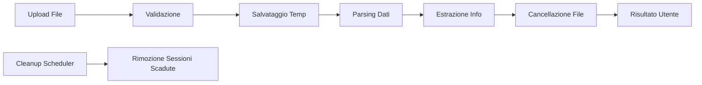

# 📤 Sistema Upload Visure Catastali - IMU 2025

## 🎯 Panoramica

Sistema completo per l'upload e parsing delle visure catastali **senza storage persistente**, progettato per massimizzare privacy, minimizzare costi e semplificare il deploy.

## 🚀 Caratteristiche Principali

### ✅ **Privacy-First**
- **File cancellati immediatamente** dopo il processing
- **Nessun dato sensibile** conservato a lungo termine
- **Conformità GDPR** automatica
- Conservazione solo dei dati catastali estratti (max 30 minuti)

### 💰 **Zero Costi Storage**
- Nessun bucket cloud necessario
- Processing in memoria/temporaneo
- Scalabilità senza costi aggiuntivi

### 🔧 **Semplicità Deploy**
- Zero configurazioni cloud storage
- Nessuna dipendenza esterna
- Funziona ovunque giri Node.js

## 📋 Formati Supportati

### 1. **CSV (Consigliato)** ✅
```csv
tipo,comune,provincia,foglio,particella,subalterno,categoria,classe,consistenza,superficie,rendita,qualita,reddito_dominicale,reddito_agrario,ubicazione,zona,piano,interno,codice_catastale,sezione,sezione_urbana
fabbricato,Milano,MI,123,456,1,A/2,3,5.5,85,1234.56,,,,"Via Roma 1","Zona 1",2,"int. 5",F205,,
terreno,Milano,MI,124,789,,,2,,5000,,SEMINATIVO,123.45,67.89,"Via Campagna sn",,,,F205,A,
```

### 2. **TXT (Visure Standard)** ⚠️
```
VISURA CATASTALE - AGENZIA DELLE ENTRATE

DATI ANAGRAFICI INTESTATARIO:
COGNOME: ROSSI
NOME: MARIO  
CF: RSSMRA80A01H501X

UBICAZIONE:
Comune: MILANO
Provincia: MI

FABBRICATI:
Fg.123 Part.456 Sub.1 Cat.A/2 Cl.3 Cons.5,5 Rendita € 1.234,56
```

### 3. **PDF** 🚧 *(In sviluppo)*
- Upload diretto PDF delle visure
- Estrazione automatica con OCR
- Pattern recognition avanzato

## 🛠️ Architettura Tecnica

### Componenti Principali

1. **`VisureParser`** - Parser multi-formato
2. **`UploadService`** - Gestione upload temporanei
3. **Cleanup automatico** - Rimozione file e sessioni scadute

### Flusso di Processing



## 🔧 Uso del Sistema

### Setup Base

```typescript
import { UploadService } from './services/upload-service';

const uploadService = new UploadService({
  maxFileSize: 10, // 10MB
  cleanupAfterMs: 30 * 60 * 1000, // 30 minuti
  allowedTypes: ['text/csv', 'text/plain', 'application/pdf']
});
```

### Processing File

```typescript
// Upload e processing
const sessionId = await uploadService.processUpload(
  fileBuffer,
  fileName,
  mimeType
);

// Recupero risultati
const session = uploadService.getSessionResult(sessionId);
if (session?.result?.success) {
  const { fabbricati, terreni } = session.result;
  // Usa i dati estratti per calcolo IMU
}
```

### Generazione Template

```typescript
const template = uploadService.generateTemplate();
// Fornisci template.content all'utente per download
```

## 📊 Dati Estratti

### Fabbricati
```typescript
interface FabbricatoCatastaleAPI {
  comune: string;
  provincia: string;
  foglio: number;
  particella: number;
  subalterno: number;
  categoria: string;      // A/2, C/1, etc.
  classe: string;
  consistenza: number;    // vani
  superficie: number;     // mq
  rendita: number;        // euro
  ubicazione: string;
  proprietario: ProprietarioCatastale;
}
```

### Terreni
```typescript
interface TerrenoCatastaleAPI {
  comune: string;
  provincia: string;
  foglio: number;
  particella: number;
  qualita: string;           // SEMINATIVO, etc.
  classe: string;
  superficie: number;        // mq
  redditoDominicale: number; // euro
  redditoAgrario: number;    // euro
  proprietario: ProprietarioCatastale;
}
```

## 🔒 Sicurezza e Privacy

### Misure Implementate

- **Validazione rigorosa** dei file upload
- **Dimensione massima** configurabile (default 10MB)
- **Tipi MIME** controllati
- **Cancellazione immediata** dopo processing
- **Sessioni temporanee** con scadenza automatica
- **Cleanup scheduler** ogni 5 minuti

### Compliance GDPR

- ✅ **Minimizzazione dati**: Solo dati necessari
- ✅ **Cancellazione automatica**: File rimossi immediatamente
- ✅ **Trasparenza**: Utente informato su tempi conservazione
- ✅ **Controllo**: Sessioni scadono automaticamente

## 📈 Monitoraggio

### Statistiche Disponibili

```typescript
const stats = uploadService.getStats();
// {
//   activeSessions: number,
//   completedToday: number,
//   errorsToday: number,
//   tempDirSize: number // KB
// }
```

### Logging

- Upload processati con successo
- Errori di parsing
- Cleanup automatico
- File temporanei rimossi

## 🚀 Integrazione Frontend

### Upload Component (Esempio React)

```tsx
function VisureUpload() {
  const [uploading, setUploading] = useState(false);
  const [result, setResult] = useState(null);

  const handleUpload = async (file: File) => {
    setUploading(true);
    
    const formData = new FormData();
    formData.append('file', file);
    
    const response = await fetch('/api/upload-visure', {
      method: 'POST',
      body: formData
    });
    
    const { sessionId } = await response.json();
    
    // Polling risultato
    const pollResult = async () => {
      const res = await fetch(`/api/session/${sessionId}`);
      const session = await res.json();
      
      if (session?.status === 'completed') {
        setResult(session.result);
        setUploading(false);
      } else if (session?.status === 'error') {
        setResult({ errors: session.errors });
        setUploading(false);
      } else {
        setTimeout(pollResult, 1000);
      }
    };
    
    pollResult();
  };

  return (
    <div>
      <input 
        type="file" 
        accept=".csv,.txt,.pdf"
        onChange={(e) => e.target.files?.[0] && handleUpload(e.target.files[0])}
      />
      {uploading && <p>Processing...</p>}
      {result && <VisureResults data={result} />}
    </div>
  );
}
```

## 🧪 Testing

### Esegui Test Completi

```bash
cd imu
npx tsx test-upload-service.ts
npx tsx test-visure-parser.ts
```

### Test Coverage

- ✅ Upload file CSV valido
- ✅ Parsing dati corretti
- ✅ Validazione file troppo grandi
- ✅ Gestione tipi non supportati
- ✅ CSV malformati
- ✅ Cleanup automatico
- ✅ Sessioni scadute
- ✅ Statistiche servizio

## 📋 Colonne CSV Obbligatorie

### Fabbricati
- `tipo` = "fabbricato"
- `comune`, `provincia`
- `foglio`, `particella`, `subalterno`
- `categoria`, `classe`
- `rendita`

### Terreni
- `tipo` = "terreno"
- `comune`, `provincia`
- `foglio`, `particella`
- `qualita`, `classe`
- `reddito_dominicale`, `reddito_agrario`

## 🎯 Vantaggi vs Supabase Storage

| Aspetto | Upload Service | Supabase Storage |
|---------|----------------|------------------|
| **Costi** | €0 | €0.021/GB/mese |
| **Privacy** | File cancellati subito | Persistenti |
| **Setup** | Zero config | Bucket + policy |
| **GDPR** | Automatico | Gestione manuale |
| **Deploy** | Semplice | Dipendenza cloud |
| **Performance** | Locale/veloce | I/O di rete |

## 🚀 Deploy Production

### Environment Variables

```env
# Opzionali - il sistema ha defaults sensati
UPLOAD_MAX_FILE_SIZE=10  # MB
UPLOAD_CLEANUP_MINUTES=30
UPLOAD_TEMP_DIR=/tmp/visure-uploads
```

### Docker (Esempio)

```dockerfile
FROM node:18-alpine

WORKDIR /app
COPY package*.json ./
RUN npm ci --only=production

COPY . .

# Crea directory temp (opzionale, creata automaticamente)
RUN mkdir -p /tmp/visure-uploads

EXPOSE 3000
CMD ["npm", "start"]
```

## 🔮 Roadmap Future

### Versione 1.1
- [ ] Supporto PDF completo con OCR
- [ ] Pattern recognition avanzato per visure
- [ ] Batch upload multipli file

### Versione 1.2
- [ ] Validazione incrociata codici catastali
- [ ] Geolocalizzazione automatica comuni
- [ ] Export risultati in formati multipli

### Versione 2.0
- [ ] ML per correzione automatica errori
- [ ] Integrazione diretta API Catasto (se disponibile)
- [ ] Dashboard analytics avanzata

## 🤝 Conclusioni

**Il sistema di upload senza storage persistente è la soluzione ottimale per IMU 2025:**

✅ **Privacy garantita** - File cancellati immediatamente  
✅ **Costi azzerati** - Nessun storage cloud necessario  
✅ **Semplicità estrema** - Deploy senza configurazioni  
✅ **Conformità GDPR** - Automatica per design  
✅ **Performance elevate** - Processing locale veloce  

**Non serve Supabase Storage** - questo sistema è più sicuro, più veloce e più economico! 🎯 